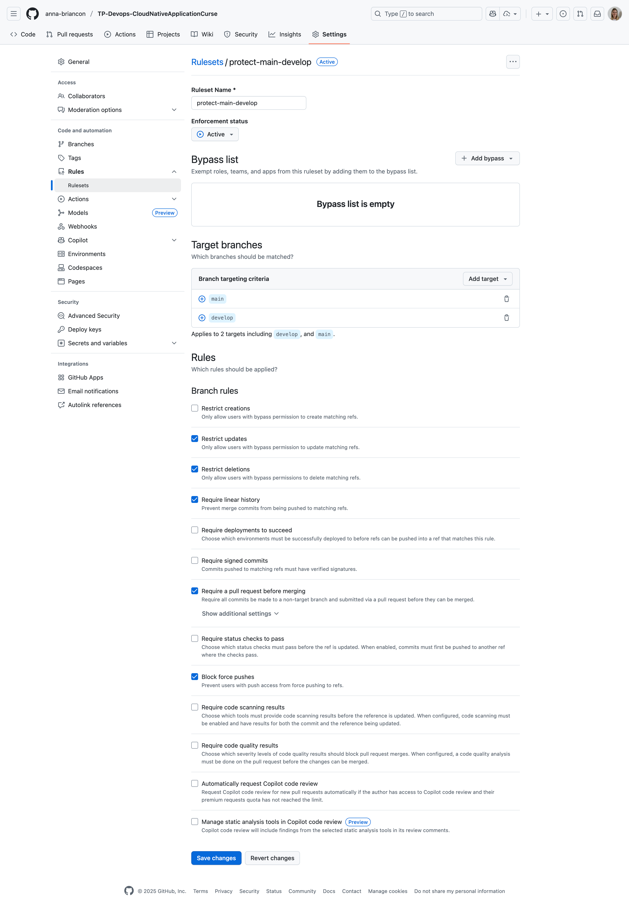
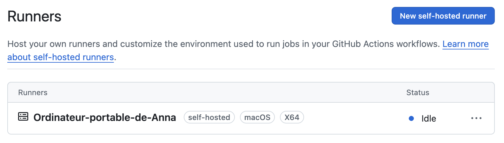
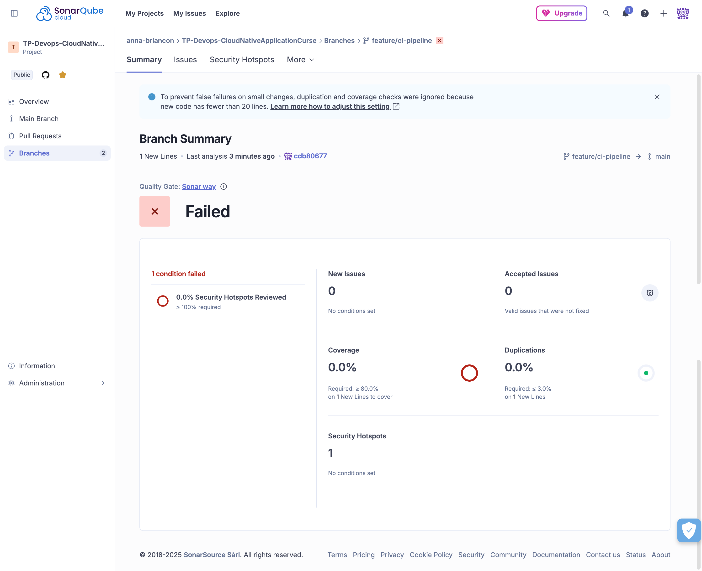
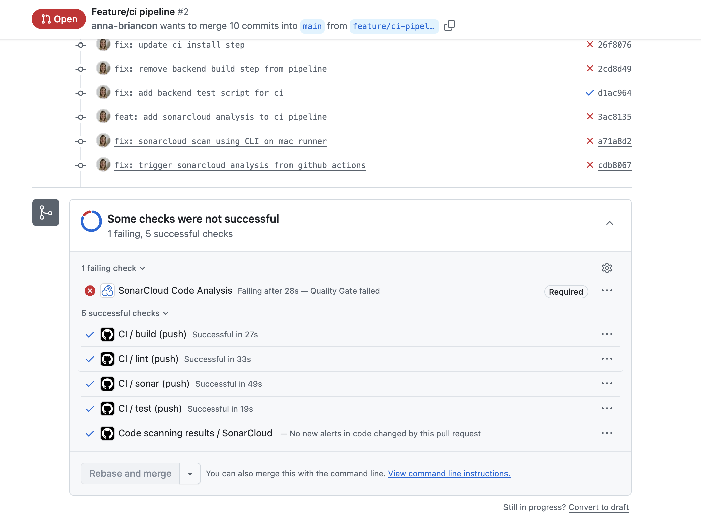
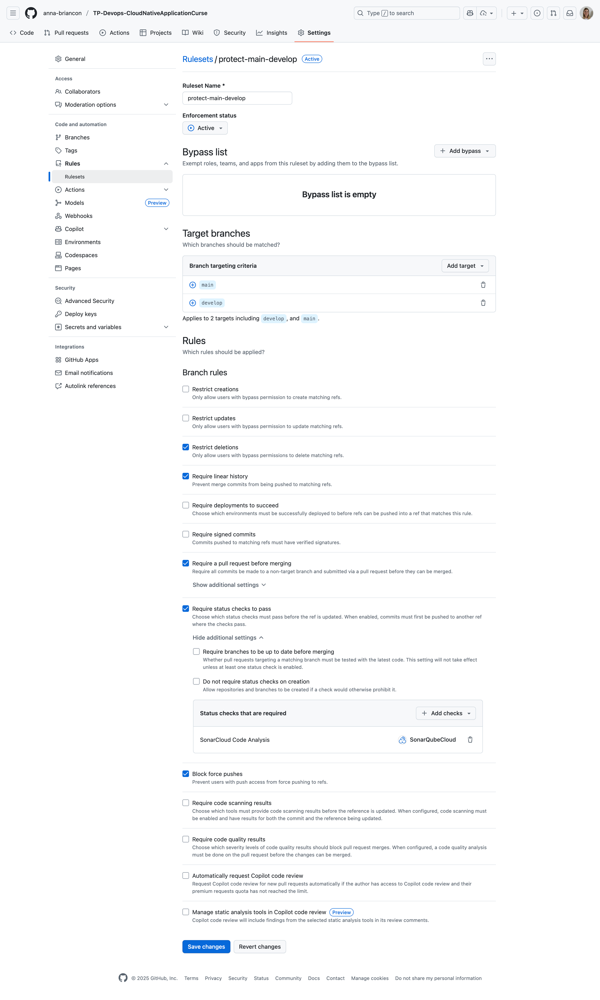

# TP1 
## Workflow Git

Ce projet suit un workflow Git clair et structuré :

- **Branches principales :**
  - `main` : code stable et prêt pour la production
  - `develop` : branche d’intégration des nouvelles fonctionnalités
- **Branches de fonctionnalité :**
  - `feature/<nom>` : une branche par fonctionnalité ou tâche
- **Règles de contribution :**
  - Tous les développements se font sur des branches `feature/*`
  - Les merges vers `develop` se font exclusivement via des Pull Requests
  - Aucun commit direct n’est autorisé sur `main` ou `develop`

Ce workflow garantit un historique clair et évite les modifications non contrôlées sur les branches critiques.


## Protection des branches

Des règles de protection sont mises en place sur GitHub afin d’assurer la qualité du code :

### 🔒 Branche `main`
- Interdiction des push directs  
- Pull Request obligatoire  
- Historique linéaire (sans merge commits)

### 🔒 Branche `develop`
- Interdiction des push directs  
- Pull Request obligatoire  
- Historique linéaire requis

Ces règles empêchent toute modification non validée par revue.



## Convention de commits

Les messages de commit suivent le format Conventional Commits.
Ce standard permet un historique clair et facilement exploitable

Exemples valides :

- `feat: ajout du système d’authentification`
- `fix: correction de la connexion PostgreSQL`
- `docs: mise à jour du README`
- `chore: mise à jour des dépendances`
- `refactor: simplification du service de réservation`

➡️ **Tout commit ne respectant pas ce format sera automatiquement rejeté par Commitlint.**

## Hooks Git (Husky)

Le projet utilise Husky pour automatiser les contrôles avant chaque commit.

### 🔧 Hooks actifs

- **`pre-commit`**
  - Exécute la commande `npm run lint:all`
  - Cette commande lance :
    - le lint du frontend (Vue 3)
    - le lint du backend (Node/NestJS)
  - Si l’un des deux linters échoue, **le commit est bloqué**

- **`commit-msg`**
  - Exécute `commitlint`
  - Vérifie que le message de commit respecte le format Conventional Commits
  - Les messages invalides sont refusés

Ces hooks garantissent une meilleure qualité de code et un historique uniforme.

---
# TP2 
## Badge CI

[](https://github.com/anna-briancon/TP-Devops-CloudNativeApplicationCurse/actions/workflows/ci.yml)

## Badge SonarCloud

[](https://sonarcloud.io/summary/new_code?id=anna-briancon_TP-Devops-CloudNativeApplicationCurse)

## Runner local (self-hosted)

Voici le runner installé sur ma machine :



## Schéma simple du pipeline CI
```
Lint (front + back)
        ↓
Build (frontend)
        ↓
Tests (backend)
        ↓
Analyse SonarCloud + Quality Gate
        ↓
PR bloquée si un check échoue
```

## Exécution de la pipeline CI

Voici l'exécution des jobs lint, build, test et sonar :


## SonarCloud – Tableau de bord

Analyse de la branche `feature/ci-pipeline` :


### SonarCloud - Quality Gate :



---

## PR bloquée (Quality Gate KO)

La PR est refusée car la Quality Gate est en échec :



---

## Protections de branches

Configuration des règles GitHub empêchant les merges sans CI et sans Quality Gate :



## Règles du workflow Git (TP1 + TP2)

- Branches principales : `main` et `develop`
- Création des features : `feature/...` depuis `develop`
- Tous les commits suivent Commitlint
- Tous les push passent par Pull Request vers `develop`
- La CI doit être verte pour valider une PR
- La Quality Gate SonarCloud doit être verte
- Push directs interdits sur les branches protégées
- Merges autorisés uniquement via PR validée

---
# Gym Management System

A complete fullstack gym management application built with modern web technologies.

## Features

### User Features
- **User Dashboard**: View stats, billing, and recent bookings
- **Class Booking**: Book and cancel fitness classes
- **Subscription Management**: View subscription details and billing
- **Profile Management**: Update personal information

### Admin Features
- **Admin Dashboard**: Overview of gym statistics and revenue
- **User Management**: CRUD operations for users
- **Class Management**: Create, update, and delete fitness classes
- **Booking Management**: View and manage all bookings
- **Subscription Management**: Manage user subscriptions

### Business Logic
- **Capacity Management**: Classes have maximum capacity limits
- **Time Conflict Prevention**: Users cannot book overlapping classes
- **Cancellation Policy**: 2-hour cancellation policy (late cancellations become no-shows)
- **Billing System**: Dynamic pricing with no-show penalties
- **Subscription Types**: Standard (€30), Premium (€50), Student (€20)

## Tech Stack

### Backend
- **Node.js** with Express.js
- **Prisma** ORM with PostgreSQL
- **RESTful API** with proper error handling
- **MVC Architecture** with repositories pattern

### Frontend
- **Vue.js 3** with Composition API
- **Pinia** for state management
- **Vue Router** with navigation guards
- **Responsive CSS** styling

### DevOps
- **Docker** containerization
- **Docker Compose** for orchestration
- **PostgreSQL** database
- **Nginx** for frontend serving

## Quick Start

### Prerequisites
- Docker and Docker Compose
- Git

### Installation

1. **Clone the repository**
   ```bash
   git clone <repository-url>
   cd gym-management-system
   ```

2. **Set up environment variables**
   ```bash
   cp .env.example .env
   ```
   
   Edit `.env` file if needed (default values should work for development).

3. **Start the application**
   ```bash
   docker-compose up --build
   ```

4. **Access the application**
   - Frontend: http://localhost:8080
   - Backend API: http://localhost:3000
   - Database: localhost:5432

### Default Login Credentials

The application comes with seeded test data:

**Admin User:**
- Email: admin@gym.com
- Password: admin123
- Role: ADMIN

**Regular Users:**
- Email: john.doe@email.com
- Email: jane.smith@email.com  
- Email: mike.wilson@email.com
- Password: password123 (for all users)

## Project Structure

```
gym-management-system/
├── backend/
│   ├── src/
│   │   ├── controllers/     # Request handlers
│   │   ├── services/        # Business logic
│   │   ├── repositories/    # Data access layer
│   │   ├── routes/          # API routes
│   │   └── prisma/          # Database schema and client
│   ├── seed/                # Database seeding
│   └── Dockerfile
├── frontend/
│   ├── src/
│   │   ├── views/           # Vue components/pages
│   │   ├── services/        # API communication
│   │   ├── store/           # Pinia stores
│   │   └── router/          # Vue router
│   ├── Dockerfile
│   └── nginx.conf
└── docker-compose.yml
```

## API Endpoints

### Authentication
- `POST /api/auth/login` - User login

### Users
- `GET /api/users` - Get all users
- `GET /api/users/:id` - Get user by ID
- `POST /api/users` - Create user
- `PUT /api/users/:id` - Update user
- `DELETE /api/users/:id` - Delete user

### Classes
- `GET /api/classes` - Get all classes
- `GET /api/classes/:id` - Get class by ID
- `POST /api/classes` - Create class
- `PUT /api/classes/:id` - Update class
- `DELETE /api/classes/:id` - Delete class

### Bookings
- `GET /api/bookings` - Get all bookings
- `GET /api/bookings/user/:userId` - Get user bookings
- `POST /api/bookings` - Create booking
- `PUT /api/bookings/:id/cancel` - Cancel booking
- `DELETE /api/bookings/:id` - Delete booking

### Subscriptions
- `GET /api/subscriptions` - Get all subscriptions
- `GET /api/subscriptions/user/:userId` - Get user subscription
- `POST /api/subscriptions` - Create subscription
- `PUT /api/subscriptions/:id` - Update subscription

### Dashboard
- `GET /api/dashboard/user/:userId` - Get user dashboard
- `GET /api/dashboard/admin` - Get admin dashboard

## Development

### Local Development Setup

1. **Backend Development**
   ```bash
   cd backend
   npm install
   npm run dev
   ```

2. **Frontend Development**
   ```bash
   cd frontend
   npm install
   npm run dev
   ```

3. **Database Setup**
   ```bash
   cd backend
   npx prisma migrate dev
   npm run seed
   ```

### Database Management

- **View Database**: `npx prisma studio`
- **Reset Database**: `npx prisma db reset`
- **Generate Client**: `npx prisma generate`
- **Run Migrations**: `npx prisma migrate deploy`

### Useful Commands

```bash
# Stop all containers
docker-compose down

# View logs
docker-compose logs -f [service-name]

# Rebuild specific service
docker-compose up --build [service-name]

# Access database
docker exec -it gym_db psql -U postgres -d gym_management
```

## Features in Detail

### Subscription System
- **STANDARD**: €30/month, €5 per no-show
- **PREMIUM**: €50/month, €3 per no-show  
- **ETUDIANT**: €20/month, €7 per no-show

### Booking Rules
- Users can only book future classes
- Maximum capacity per class is enforced
- No double-booking at the same time slot
- 2-hour cancellation policy

### Admin Dashboard
- Total users and active subscriptions
- Booking statistics (confirmed, no-show, cancelled)
- Monthly revenue calculations
- User management tools

### User Dashboard
- Personal statistics and activity
- Current subscription details
- Monthly billing with no-show penalties
- Recent booking history

## Contributing

1. Fork the repository
2. Create a feature branch
3. Make your changes
4. Add tests if applicable
5. Submit a pull request

## License

This project is licensed under the MIT License.

## Support

For support or questions, please open an issue in the repository.

